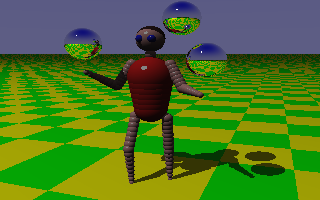

# Eric Graham's 1987 Amiga Juggler raytracer (Part 4): Reading the code

In Part 3 I reconstructed the lost `SSG` renderer from the original 1987 Amiga
executable, checked it byte-for-byte against the binary, and gave the old
`robot.dat`, `ele.dat`, and `dragon.dat` scene files a working source-level
renderer again.

This part is different. I want to stop talking about *how* the source was
recovered and just talk about the code itself. Because the interesting thing
about this program is not that it was reverse engineered. The interesting thing
is that it is a complete, recognizable, honest raytracer written in about three
hundred lines of C, in 1987, by one person, reportedly in a day, and that almost
every line of it is doing something clever to fit a renderer into a 7 MHz machine
with 4096 possible colors and no floating-point unit.

Here is the Juggler, rendered right now by the reconstructed C, running on my
desktop:



Everything you see there — the robot, the three balls it is juggling, the
elephant in the companion scene, the dragon in the third — is made out of one
primitive. Spheres. That single decision is the key to the whole program, so
let's start there.

## Everything is a sphere

There are no polygons in this raytracer. There are no cylinders, no boxes, no
meshes, no CSG. There are spheres, one infinite ground plane, and lamps (which
are themselves just spheres that emit light). That's the entire vocabulary of
the world.

You would think that limits you to snowmen and molecular models. It does not.
Look at the robot's arms and legs, or the elephant's trunk and body. Those are
*chains* of overlapping spheres of smoothly varying radius. Line up enough
spheres along a curve, shrink and grow them as you go, and you get something the
eye happily reads as a tapered limb or a segmented trunk.

The scene file makes this cheap to describe. Here is the robot's upper right arm,
straight out of `robot.dat`:

```text
<1,.7,.7>  1  (0,0.6,2.9):0.2 6 (-0.6,0.6,1.6):0.2
              7 (-0.4,0.6,0):0.1;
```

Read that as: a pinkish (`<1,.7,.7>`), specular (`1`) object that starts as a
sphere of radius `0.2` at `(0, 0.6, 2.9)`. Then `6 (-0.6,0.6,1.6):0.2` means
*insert 6 spheres interpolating from where we are to a radius-0.2 sphere at
`(-0.6, 0.6, 1.6)`*. Then `7 (-0.4,0.6,0):0.1` continues the chain with 7 more
spheres tapering down to radius `0.1`. The `;` ends the object.

That "control point, then a count and the next control point" grammar is the
entire modeling language. The parser that expands it is tiny. Given a base
sphere and a segment, it just walks a linear interpolation:

```c
total = count + 1;
for (i = 1; i <= total; ++i) {
    t = (float)i / (float)total;
    for (k = 0; k < 3; ++k)
        sp.pos[k] = lastpos[k] + (nextpos[k] - lastpos[k]) * t;
    sp.radius = lastradius + (nextradius - lastradius) * t;
    push_sphere(sv, &sp);
}
```

The endpoints are shared between adjacent segments (the loop starts at `i = 1`,
not `0`, because the previous segment already emitted the shared sphere), so a
long chain doesn't double up spheres at its joints. This is why `robot.dat`
expands to exactly 79 spheres, `ele.dat` to 120, and `dragon.dat` to 288 — the
`.dat` file stores a few dozen control points and the loader inflates them into
hundreds of primitives. It is, in spirit, a 1987 spline: skeletons in, solid
forms out.

The payoff is that the renderer's inner loop only ever has to know how to
intersect a ray with a sphere. One primitive. One intersection routine. That
simplicity is what buys the whole thing its performance budget.

## Intersecting a ray with a sphere

The ray/sphere test is the workhorse — it runs for every sphere, for every
pixel, and *again* for every sphere for every shadow test, so it has to be lean.
It's the classic quadratic:

```c
a = b = 0.0;
c = -(sp->radius * sp->radius);
for (k = 0; k < 3; ++k) {
    p = line[k*2]   - sp->pos[k];   /* origin component  */
    q = line[k*2+1];                /* direction component */
    a += q*q;
    b += 2*q*p;
    c += p*p;
}
d = b*b - 4.0*a*c;
if (d <= 0.0) return 0;             /* line misses sphere */
d = sqrtf(d);
*t = -(b + d) / (a + a);
if (*t < SMALL) *t = (d - b) / (a + a);
return *t > SMALL;
```

A ray here is stored as six interleaved floats — `(origin, direction)` for x, y,
z — which is why the loop indexes `line[k*2]` and `line[k*2+1]`. Substitute the
parametric point `origin + t*direction` into the sphere equation, collect the
`a·t² + b·t + c` coefficients, and solve. The nice touch is the near-root
handling: it computes the far intersection first, and only if that is behind the
`SMALL` epsilon does it fall back to the other root. That epsilon is doing double
duty — it rejects the sphere you are *standing on* when you cast a shadow ray, so
a surface doesn't shadow itself into acne.

There's a stripped-down twin, `qintsplin`, that returns only "hit / no hit"
without computing `t`, for the cases where you only need to know whether a light
is blocked. When your FPU is a software library, not computing a value you won't
use is a real saving.

## Shading: a fake sky, real lamps, and hard shadows

Once you know which sphere a ray hit and where, `pixbrite` decides how bright
that spot is. The model has two parts, and the first one is a lovely cheat:

```c
static float zenith[3] = {0.0, 0.0, 1.0}, f1 = 1.5, f2 = 0.4;
diffuse = (dot(zenith, p->normal) + f1) * f2;
for (k = 0; k < 3; ++k)
    brite[k] = diffuse * w->illum[k] * p->color[k];
```

There is no ambient-occlusion, no global illumination, no second bounce for
diffuse light. Instead, surfaces are lit by *the sky itself*, approximated as a
single term that depends only on how much the surface normal points up. A patch
facing straight up (`dot(zenith, normal) == 1`) gets `(1 + 1.5)*0.4 = 1.0`; one
facing straight down still gets `(-1 + 1.5)*0.4 = 0.2`, so nothing is ever fully
black. It is a hemisphere light baked into two magic constants. For the cost of
one dot product you get soft, plausible fill lighting that makes the spheres read
as rounded rather than flat.

The second part is the actual lamps. For each lamp, cast a ray from the surface
point toward the lamp; if any *other* sphere blocks it, this point is in shadow
for that lamp and contributes nothing:

```c
genline(line, p->pos, w->lmp[l].pos);
for (k = 0; k < w->numsp; ++k) {
    if (&w->sp[k] == self) continue;   /* don't shadow yourself */
    if (intsplin(&t, line, &w->sp[k])) goto blocked;
}
r = sqrt(dot(lp, lp));
cosi = cosi / (r*r*r);                  /* inverse-cube falloff */
for (k = 0; k < 3; ++k)
    brite[k] += cosi * p->color[k] * w->lmp[l].color[k];
```

Two things worth noting. First, the shadow test is brute force — every shadow ray
is tested against every sphere — which is exactly the honesty a one-day renderer
can afford and a big scene cannot. This is why `dragon.dat` with its 288 spheres
takes real time to render. Second, the falloff is *inverse cube*, not the
physically-correct inverse square. `cosi` already carries one factor of distance
(it's an un-normalized dot product), and dividing by `r³` gives Lambert's cosine
term times a `1/r²` intensity. It works out to the right physics, just folded
together to save a normalize.

## Three kinds of surface

Each sphere carries a `type`, and `raytrace` switches on it — this is the whole
material system:

```c
switch (spnear->type) {
case BRIGHT:                                   /* type 1: shiny */
    if (glint(brite, &patch, w, spnear, line)) return 0;
    pixbrite(brite, &patch, w, spnear);
    return 0;
case DULL:                                     /* type 0: matte */
    pixbrite(brite, &patch, w, spnear);
    return 0;
case MIRROR:                                   /* type 2: reflective */
    mirror(brite, &patch, w, line);
    return 0;
}
```

**Dull** is just the diffuse model above. **Bright** first asks `glint` whether
the reflected view direction lines up with a lamp closely enough (dot product
past `0.95`) to be a specular highlight; if so, the pixel is blown to pure white,
otherwise it falls through to the same diffuse shading. That's the tight white
speck you see on the robot's body and eyes. **Mirror** is the fun one:

```c
reflect(refvec, p->normal, incvec);
line[0]=p->pos[0]; line[1]=refvec[0];
line[2]=p->pos[1]; line[3]=refvec[1];
line[4]=p->pos[2]; line[5]=refvec[2];
raytrace(brite, line, w);                  /* recursion saves the day */
for (k = 0; k < 3; ++k) brite[k] *= p->color[k];
```

The mirror builds a new ray from the reflection of the incoming direction and
calls `raytrace` again — the whole renderer, recursively. Whatever that bounced
ray sees is tinted by the sphere's own color and returned. Those are the three
juggled balls: mirror spheres reflecting the checkered floor and the sky back at
you. There is no recursion-depth limit in the code at all; it relies on the
geometry (a reflected ray usually escapes to the sky or the ground) to terminate.
A hall of mirrors would run forever, but no shipped scene contains one.

(This reflection routine, incidentally, is the one place where the reconstructed
`SSG` and Eric's *published* `rt1.c` genuinely disagree. The published listing's
`reflect` computes a strange, arguably-broken expression; the binary uses the
textbook `x - 2(x·n)n`. When the reconstruction matched the binary's version, the
remaining pixel differences against the original renders collapsed to a handful
of bytes. The shipped source and the shipped executable were simply built from
slightly different code — a small, very human piece of software archaeology.)

## The "cheap vinyl" floor

The ground plane is infinite and it is a checkerboard, and the way it's colored
is my favorite three lines in the program:

```c
int gingham(float *pos) {          /* are we on 'black' or 'white' tile? */
    int kx = 0, ky = 0;            /* tiles are 3 units wide */
    float x = pos[0], y = pos[1];
    if (x < 0.0) { x = -x; ++kx; }
    if (y < 0.0) { y = -y; ++ky; }
    return ((((int)x)+kx)/3 + (((int)y)+ky)/3) % 2;
}
```

Eric's own comment calls it "cheap vinyl." Truncate the world x and y to
integers, divide by the 3-unit tile size, add the two, and take it mod 2 — even
sums are one tile color, odd sums the other. The `kx`/`ky` bump on the negative
side is there because integer truncation is symmetric around zero and would
otherwise put a double-width tile straddling each axis; nudging the negative
half by one cell keeps the checker phase continuous across the origin. It returns
`0` or `1`, which indexes into the two `horizon` patches the scene defines, each
with its own color. That's the whole floor: no texture, no lookup table, one
integer parity test per ground pixel.

The sky is nearly as cheap — `skybrite` blends the horizon color to the zenith
color by `sin²` of the ray's elevation, so the gradient is dense near the horizon
and open overhead, the way a real sky looks.

## Automatic exposure, in 1987

Here's something you don't often see even in modern toy renderers. Before
rendering a single pixel, `expose_lamps` runs an auto-exposure pass:

```c
lampfac = BIG;
for (i = 0; i < w->numsp; ++i)
    for (j = 0; j < w->numlmp; ++j) {
        vecsub(tp, w->sp[i].pos, w->lmp[j].pos);
        r = sqrt(dot(tp, tp)) - w->sp[i].radius;
        for (k = 0; k < 3; ++k) {
            t = w->sp[i].color[k]*w->lmp[j].color[k]/(r*r);
            if (t == 0.0) continue;
            t = (1.0 - w->sp[i].color[k]*w->illum[k]) / t;
            if (t < lampfac) lampfac = t;
        }
    }
for (j = 0; j < w->numlmp; ++j)
    for (k = 0; k < 3; ++k) w->lmp[j].color[k] *= lampfac;
```

It walks every sphere/lamp/channel combination and asks: *how much headroom is
left between this surface's ambient contribution and full white, and how strong
would this lamp make it?* The smallest ratio across the whole scene — the surface
that would clip first — becomes the global lamp multiplier. Then it scales all
lamp intensities by that factor.

In plain terms: the brightest point that any lamp will produce is dialed to sit
right at the top of the displayable range, and nothing blows out. It is a
physically-motivated exposure meter for a scene with no camera, computed once, in
a double loop, before the raytracer starts. On a machine that displayed 16
shades per channel, getting the exposure right *automatically* was the difference
between a picture and a muddy or clipped mess.

## The reason it's beautiful: HAM

Everything above computes a full RGB brightness per pixel in floating point. But
the Amiga's low-resolution display could show 16 levels per channel, and a normal
indexed screen gave you only 16 or 32 colors on screen at once from that palette.
The Juggler's smooth gradients and reflections plainly have thousands of colors.
The trick is **HAM** — Hold-And-Modify — an Amiga display mode that let you show
all 4096 colors at once, with a catch, and the encoder for it (`ham.c`) is where
this program earns its keep.

In HAM6, each pixel's six bits are read as either "pick one of 16 palette
registers" *or* "keep the previous pixel's color but replace one channel (R, G,
or B) with these four bits." So most pixels don't get an absolute color at all;
they nudge one channel of their left neighbor. You get near-arbitrary color at
the price of a one-pixel horizontal smear whenever the color changes sharply.

The encoder walks each scanline left to right holding the previous pixel's color,
and for every pixel makes a decision:

```c
dif = coldist(pix, prev);                 /* how far from the last pixel? */
if (dif) {
    pen = nearestp(ham, pix, &dif2);      /* nearest palette register */
    if (dif2 < dif) {                     /* register is closer: use it */
        ...set pixel to register pen...
        continue;
    }
}
/* otherwise modify the single channel that's most wrong */
id = channel_with_largest_difference(pix, prev);
pen = map[id] + pix[id];                  /* map[] = {0x20,0x30,0x10} */
prev[id] = pix[id];
```

For each pixel it weighs two options: jump to the nearest of the (up to 16)
palette registers, or hold the neighbor and modify its single most-wrong channel.
It picks whichever lands closer to the true color. The `map[]` table encodes
which channel is being modified into the top control bits. The palette itself is
grown lazily by `nearestp`: it starts with just black and white pre-allocated,
and any time a pixel is farther than a distance threshold from every existing
register, a new register is allocated to that exact color — until all 16 are
used. So the 16 registers become the 16 most useful "anchor" colors for *this
particular image*, and HAM fills in everything between them.

Two subtleties the reconstruction had to recover from the binary. There is a
small pseudo-random dither added before each channel is crushed from 8 bits down
to 4, which breaks up banding in the gradients. And there is an optional blur
(`B=`) that averages a pixel with its eight neighbors before encoding, trading a
touch of sharpness for fewer HAM fringes. Neither appears in the published `rt`
listing; both were in the shipped renderer, and both matter to how the final
frames look.

The distance metric is worth a second glance too. `coldist2` is a plain sum of
absolute channel differences, but `coldist` — used to decide register-vs-modify —
subtracts the *largest* channel difference from the sum:

```c
return r - m;   /* sum of |differences|, minus the biggest one */
```

That's a small stroke of genius. A single HAM pixel can fix exactly one channel
perfectly. So the "cost" of the hold-and-modify path is what's left wrong *after*
your best channel is corrected — the sum minus its max term. The metric is shaped
to match what the hardware can actually do in one pixel.

## What the whole thing adds up to

Strip out the command-line handling and the Amiga display glue and the renderer
proper is remarkably small. A tag file that maps the pieces:

```text
pixline    build the ray for pixel (i, j)
intsplin   ray/sphere intersection (the hot loop)
inthor     ray/ground-plane intersection
raytrace   the recursive core: nearest hit, then shade or bounce
pixbrite   sky fill + lamps + hard shadows
glint      specular highlight test
mirror     recursive reflection
skybrite   zenith-to-horizon sky gradient
gingham    the checkerboard floor
reflect    law of reflection
expose_lamps   automatic exposure
```

That's the entire raytracer. A handful of routines, none longer than a screen,
each doing one geometric or optical job, composed into images that made people
buy a computer. When the Juggler animation shipped on a Fish Disk in 1987, people
did not believe a home computer had produced it.

Reading the code now, what strikes me is how little of it is wasted. Every
approximation — the two-constant sky light, the inverse-cube falloff folded into
one divide, the integer-parity floor, the lazily-grown HAM palette, the
sum-minus-max color metric — is a considered trade between fidelity and a very
small compute budget. This is not sloppy code that happened to look good. It is
tight code by someone who understood exactly which corners could be cut and which
could not, and cut precisely those.

Eric Graham said he is bemused to be most remembered for something he wrote in a
day. Having now read every line of it, I think the day was so productive
*because* of everything he knew before that day. The reconstructed source is
here so the rest of us can read it too.

## Matching the hand, not just the output

Getting the same *pixels* as the 1987 binary is only half of what it means to
recover lost source. A reconstruction that draws the right picture but reads like
2026 C tells you what the program computed, not how Eric built it. So the
reconstruction goes further: every naming, structural, and stylistic choice is
pinned to a surviving artifact — Eric's published `rt1.c`/`rt2.c`/`rt3.c`, the
`rt.h` declarations, or the strings and code recovered from the executable itself.

- **Eric's own names.** Bare `raytrace`, `dot`, `pixbrite`, `setupfromdat` — the
  last one literally named in the surviving `rt2.c`/`rt.h`. Bare `struct sphere`,
  `struct world`. No namespacing; there was no namespacing in a one-file 1987
  program.
- **The binary's own grammar, read the binary's own way.** The scene reader
  `fscanf`s straight off the file stream using the exact format strings recovered
  from the executable — `(%lf,%lf,%lf)`, `<%lf,%lf,%lf> %d`, `(%lf,%lf,%lf):%lf` —
  and finds objects the way the decompiled reader does: read one character, test
  it for `<` or `;`, skip only newline/space/tab. It allocates the sphere table
  the binary's way too — a single fixed block of exactly 400 records up front
  (`AllocMem(0x5140)`), no growing list. The tempting shortcuts — slurp the whole
  file into a buffer, hand-roll a scanner, grow a vector — would all draw the same
  picture and all be wrong about how the program actually works.
- **Eric's typos and quirks preserved.** The HAM color registers keep his
  file-scope `creg`/`nallocr` globals, and the distance threshold is spelled
  `threshhold` — with the extra `h` — exactly as it appears in `rt3.c`. "Fixing"
  that spelling is exactly the kind of well-meaning damage a historical
  reconstruction should not do.
- **The right error messages.** On a bad open it prints `input file error on
  '%s'`; on a parse error it prints `Error before:` and dumps the offending text
  — both real strings lifted from the binary, not tidier ones invented to read
  nicer.
- **Eric's dense formatting.** Multiple statements per line, trailing comments,
  the works.

None of that changes a single output byte — the reconstruction is validated
against the original Amiga executable and reproduces its renders. The style work
isn't cosmetic dress on a modern approximation; it is the reconstruction *being*
the thing: computing what the 1987 binary computed, and saying it the way Eric
would have.

### Eric's raytracer isn't brute force

The most interesting thing the decompilation gave up is something no amount of
looking at the *output* would ever reveal: **the original renderer is not brute
force.** The obvious way to write a raytracer tests every sphere against every
pixel, and for 79 spheres on a modern CPU, who cares. Eric, on a 7 MHz 68000 with
software floating point, very much cared, and his code is a screen-space-culling
engine.

Reading it back out of the binary: at load time, every sphere is *projected* to a
screen-space bounding box and tagged as behind the camera, straddling it, or
wholly in front. (This is why the binary's sphere record is a curious 52 bytes —
those extra fields aren't padding, they're the projected box and a visibility
flag, wedged between the radius and the material type.) Then, before each scanline
is drawn, the renderer gathers the spheres whose vertical extent crosses that row
into a short *active list*. And for each pixel, the nearest-hit search walks only
that list, skipping any sphere whose horizontal extent doesn't contain the column.
Reflected mirror rays — which don't line up with the screen — quietly fall back to
testing everything.

The reconstruction includes all of it: the projection math (the same perspective
map the primary rays use, inverted, `V`-flag axis-swap and all), the per-scanline
active lists, the per-pixel column cull, and even the whole-scene bounding sphere
the binary builds once a scene has three or more spheres. Because a *correct* cull
only ever skips spheres that provably can't be hit at that pixel, the pictures
don't change by a single byte — the culled renderer is verified against a plain
every-sphere search and runs faster (very much so on the 288-sphere dragon).
That's the whole point: it's the same image, produced the way Eric produced it.

A few things are honestly still reconstructions rather than recoveries, and the
source says so where they occur: the small dither and the `B=` blur in the HAM
path were recovered from the executable's *behavior* (they aren't in the published
`rt3.c`), so their math is verified but their original phrasing is a guess; the
number reads add a leading space to the recovered `scanf` strings so a modern
`fscanf` skips the whitespace the Amiga library skipped for free; and the
whole-scene bounding sphere is built exactly as the binary builds it but its
consumer wasn't found in the recovered render code, so it's kept for load-time
fidelity rather than wired into the cull. The one unavoidable modernization is
ANSI function prototypes in place of Eric's K&R declarations — the same concession
the published `rt` port had to make to build on a current compiler.

The result is source you can read to see what Eric's afternoon actually looked
like — as close as the surviving evidence lets us get.

---

*The reconstructed `SSG` source lives in this repository under
`ssg-src-authentic/` (the `ssg_authentic` target). It builds with MSVC and gcc and
reproduces the original Amiga binary's renders to within a handful of bytes,
verified by `tools/validate-ssg.py`. The images in this post were produced by that
reconstructed C. All original raytracer code is copyright Eric Graham, released by
him into the public domain in 2026 with the single, entirely reasonable condition
that he be credited.*
